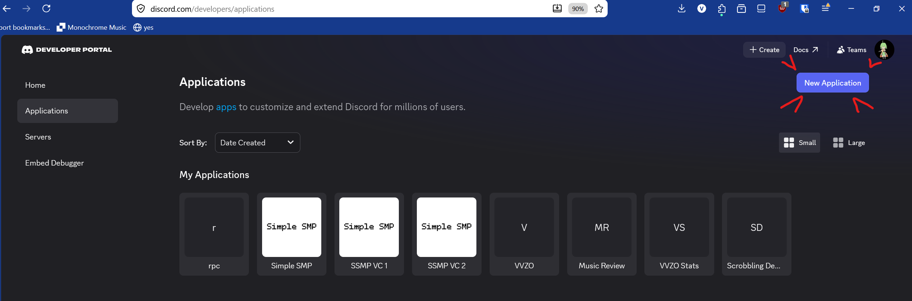
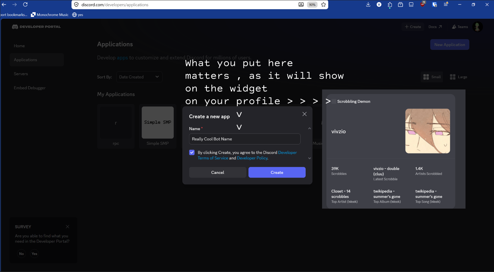
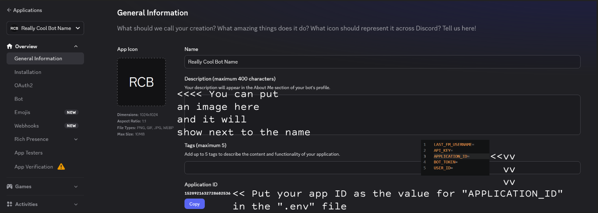

# Last.FM Discord Widget
This repository will contain information on how to set up a Last.FM Widget on your Discord profile (similar to the "Wuthering Waves" widget).
I wanna give a big thanks to [Chloe Cinders](https://chloecinders.com/blog/discord-widgets) for making a blog post about this, and [No Text To Speech](https://youtube.com/@NoTextToSpeech) for making a video tutorial on Chloe's blog post.

# Requirements
Python (I developed this with Python 3.14.3)
"dotenv" Python library (pip install dotenv)
A Discord [developer application](https://discord.com/developers/applications)

# Setting up the Discord app

1. Go to the [Discord Developer Portal](https://developers/applications) and create an application

